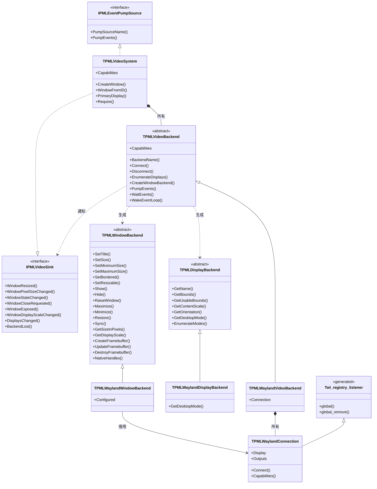
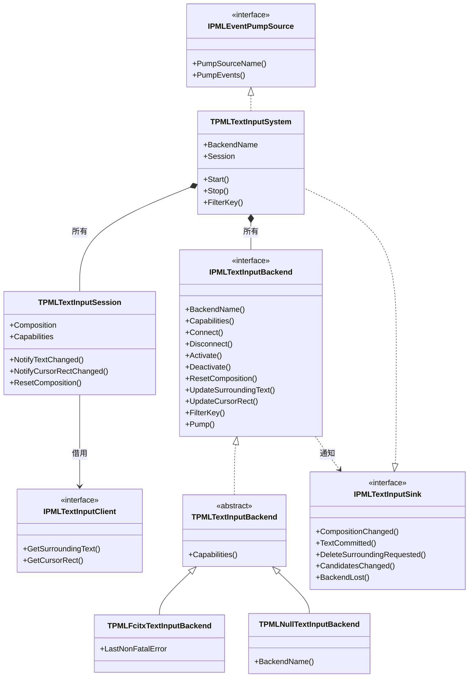

# バックエンド抽象化のクラス図

Design: `docs/DESIGN.md` §3.2、§3.3

**実装済みのものだけを描いてある。** 設計書が予定していて未実装のものは図に入れず、
文章で註記するに留める。図と実装が乖離するのを防ぐため、この方針は維持すること。

生成プロトコルの型（リスナー抽象クラス 45 個、不透明プロキシ型 80 個）は**除外**している。
機械的なバインディングなので図に入れても情報量がなく、読み手の注意を奪うだけである。
唯一の例外として、Wayland バックエンドが生成リスナーを継承している事実だけ
`Twl_registry_listener` の 1 箱で示す。

図は構造だけを示し、理由は図の外の文章に書く。Mermaid の箱に散文を詰めると読めなくなるため。

---

## 1. なぜこの形なのか

SDL は `SDL_VideoDevice` という**単一の構造体に 98 個の関数ポインタ**を持っていた。
初期化・ディスプレイ列挙・ウィンドウ操作 44 個・OpenGL 11 個・Vulkan 6 個・Metal 3 個・
イベントポンプ・クリップボード 10 個・IME 4 個・スクリーンキーボード 4 個などが同居しており、
バックエンドが対応しない操作は「関数ポインタが `nil`」で表されていた。

| | SDL | papimela |
|---|---|---|
| 構造 | `SDL_VideoDevice` 1 個に 98 関数ポインタ | デバイス / ディスプレイ / ウィンドウの 3 抽象クラス＋任意搭載の部品 |
| 未対応の表現 | 関数ポインタが `nil`。呼ぶ側が毎回検査 | 能力集合 `Capabilities`。公開層が 1 箇所で判定 |
| IME | video device の一部（`StartTextInput` 等 4 個） | **独立した軸**（下の図 2） |
| 逆方向の通知 | グローバル関数を直接呼ぶ | `Sink` インターフェース。バックエンドは公開層の型を知らない |

---

## 2. ビデオ軸



**要点。**

- `IPMLVideoSink` の引数はすべて**ウィンドウ ID**である。バックエンドは公開層の
  `TPMLWindow` を知らない。god object を分解できた要因のひとつがこれで、
  依存が一方向（公開層 → 抽象 → 実装）に保たれる。
- 設計 §3.2 は `TPMLVideoBackend` に任意搭載の部品 8 種（GL / Vulkan / Clipboard /
  Cursors / ScreenSaver / MessageBox / SystemMenu / ScreenKeyboard）を持たせる予定だが、
  いずれも未実装なので図に入れていない。
- `TPMLWindowBackend` の 19 メソッドが、SDL でウィンドウ操作 44 個を占めていた部分に相当する。
  残り 25 個（フルスクリーン・不透明度・形状・グラブ・ヒットテスト等）は未実装。
- `TPMLWaylandConnection` が生成リスナー `Twl_registry_listener` を継承しているのは、
  レジストリの `global` イベントでグローバルを束縛するため。

---

## 3. IME 軸（ビデオ軸から独立）



**要点。**

- ビデオ軸とまったく同じ形をしている。**公開層 → 抽象バックエンド → 具体実装**、
  および逆方向の `Sink`。違いは `IPMLTextInputClient` の存在だけで、これは
  **アプリ自身が実装する契約**である（周辺テキストをアプリから引き出す必要があるため）。
- IME 軸はビデオ軸の型を知らない。Wayland ビデオ + fcitx5 IME の組み合わせが成立するのは
  この独立性のため（設計 §3.6）。SDL は IME を video device の一部として持っており、
  それが文節情報を削る構造の原因になっていた。
- `TPMLTextInputSystem` が `IPMLTextInputBackend` を**インターフェースで保持しつつ実体も
  別に持っている**のは、CORBA インターフェースが参照カウントしないため（不具合 D-08）。
  図では `*--`（コンポジション）1 本で表している。

---

## 4. 両軸が共有している形

```
公開層（能力判定・イベント発行）
   │  所有
   ▼
抽象バックエンド ──────┐
   │  継承             │ Sink インターフェース経由で逆方向へ通知
   ▼                   │ 公開層の型を知らない
具体実装 ──────────────┘
```

公開層はどちらも `IPMLEventPumpSource` としてイベントキューに登録され、`Poll` / `Wait` が
全ソースを登録順に `Pump` する。ビデオも IME もこの点で対等である。

---

## 5. この図に無いもの

| 対象 | 理由 |
|---|---|
| 生成プロトコルの 125 型 | 機械的なバインディング。`Twl_registry_listener` 1 箱で代表させた |
| 任意搭載の部品 8 種 | 未実装（第 11 章 #33、#38、#39、#40、#67） |
| シート（キーボード / ポインタ / タッチ） | 未実装（#37） |
| IBus / WaylandTI バックエンド | 未実装（#48、#49） |
| 所有グラフ全体・イベントモデル・基底クラス・IME の値型 | それぞれ別の図にすべき対象。1 枚に詰めると読めなくなる |
