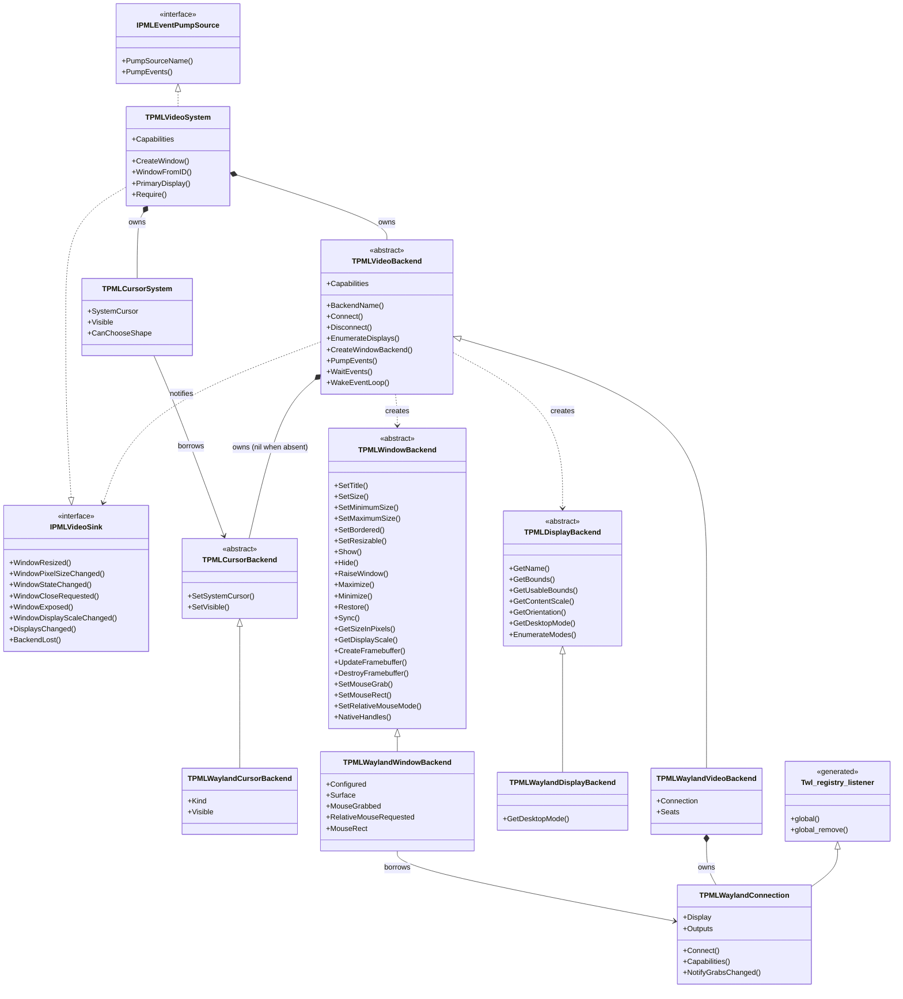
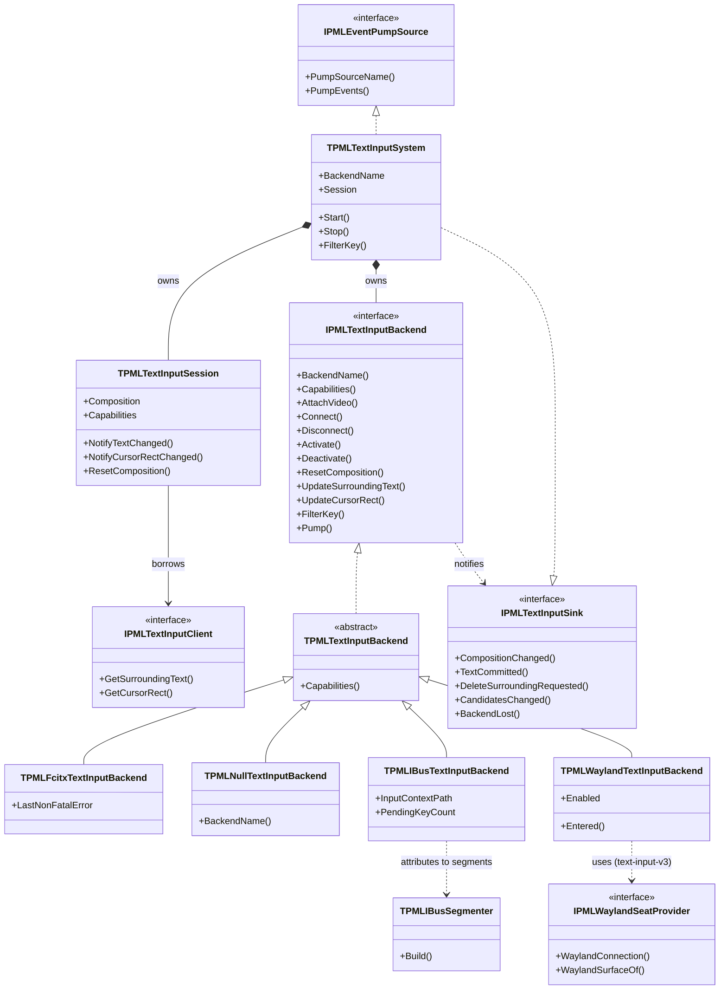

# Backend Abstraction

Design: `docs/DESIGN.md` §3.2, §3.3 — Japanese version: [`backend-abstraction_jp.md`](backend-abstraction_jp.md)

**Only implemented types are drawn.** Anything the design plans but has not been built yet is
mentioned in prose, never drawn. This keeps the diagram from drifting away from the code.

The 125 generated protocol types (45 listener abstract classes, 80 opaque proxy types) are
**excluded** — they are mechanical bindings and would drown out the structure. The single
exception is `Twl_registry_listener`, kept to show that the Wayland backend inherits from
generated listeners.

Diagrams carry structure only; the reasoning lives in the prose around them.

---

## 1. Why this shape

SDL puts **98 function pointers into one struct**, `SDL_VideoDevice`: initialization, display
enumeration, 44 window operations, 11 OpenGL entries, 6 Vulkan, 3 Metal, event pumping,
10 clipboard entries, 4 IME entries, 4 screen-keyboard entries. An operation a backend does not
support is expressed as a `nil` function pointer that every caller must check.

| | SDL | papimela |
|---|---|---|
| Structure | one `SDL_VideoDevice` with 98 function pointers | three abstract classes (device / display / window) plus optional parts |
| Unsupported operations | `nil` function pointer, checked at every call site | capability set, checked once in the public layer |
| IME | part of the video device (`StartTextInput` and 3 more) | **a separate axis** (diagram 2) |
| Reverse notifications | backend calls global functions directly | `Sink` interface; the backend never sees public-layer types |

---

## 2. Video axis



**Notes.**

- Every `IPMLVideoSink` argument identifies a window by **ID**, never by object. The backend does
  not know `TPMLWindow`. This one-way dependency (public → abstract → implementation) is what made
  splitting the god object possible.
- §3.2 also gives `TPMLVideoBackend` eight optional parts (GL, Vulkan, Clipboard, Cursors,
  ScreenSaver, MessageBox, SystemMenu, ScreenKeyboard). `Cursors` and `GL` exist so far; only
  `Cursors` is drawn. The GL part (`TPMLGLBackend` → `TPMLEGLBackend` → `TPMLWaylandEGL`) is
  described in `docs/DESIGN.md` §3.4. A part the compositor cannot support stays nil, and the capability set says so.
- The 22 methods on `TPMLWindowBackend` correspond to the window-operation slice of SDL's 44.
  The remaining 22 (fullscreen, opacity, shape, icon, keyboard grab, hit-testing) are not
  implemented. The three pointer-constraint methods only record a request: the constraint object
  belongs to `wl_pointer`, so `TPMLWaylandConnection.NotifyGrabsChanged` hands the change to the
  seats, and `TPMLWaylandPointerGrab` decides which constraint to hold (see `event-model.md`).
- `TPMLWaylandConnection` inherits the generated `Twl_registry_listener` because it binds globals
  from the registry's `global` event.

---

## 3. IME axis (independent of the video axis)



**Notes.**

- The shape is identical to the video axis: public layer → abstract backend → concrete
  implementation, plus a `Sink` for the reverse direction. The only structural difference is
  `IPMLTextInputClient`, a contract **the application implements**, because surrounding text has to
  be pulled out of the application's own buffer.
- The IME axis does not know any video type. That independence is why "Wayland video + fcitx5 IME"
  composes (§3.6). SDL made IME part of the video device, which is the structural reason its
  composition events lose clause information.
- `TPMLTextInputSystem` holds the backend **through the interface and separately as an object**,
  because CORBA interfaces are not reference-counted (defect D-08). The diagram shows this as a
  single composition edge.

---

## 4. The shape both axes share

```
public layer (capability checks, event emission)
   |  owns
   v
abstract backend -----+
   |  inherits        | notifies back through a Sink interface
   v                  | (never sees public-layer types)
concrete backend -----+
```

Both public layers register with the event queue as `IPMLEventPumpSource`; `Poll` and `Wait`
pump every registered source in registration order. Video and IME are peers in this respect.

---

## 5. Not in this diagram

| Subject | Reason |
|---|---|
| the 125 generated protocol types | mechanical bindings; `Twl_registry_listener` stands in for them |
| the GL part (`TPMLGLBackend` and its EGL / Wayland subclasses) | implemented (#33, #39), not drawn yet |
| the other six optional backend parts | not implemented (chapter 11: #38, #40, #67 and later) |
| seats (keyboard / pointer / touch) | implemented (#37); drawn in `event-model.md` |
| IBus and WaylandTI backends | not implemented (#48, #49) |
| ownership graph, event model, base classes, IME value types | separate diagrams; cramming them here would make it unreadable |
