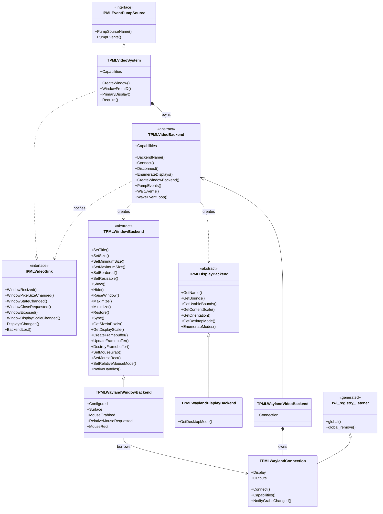
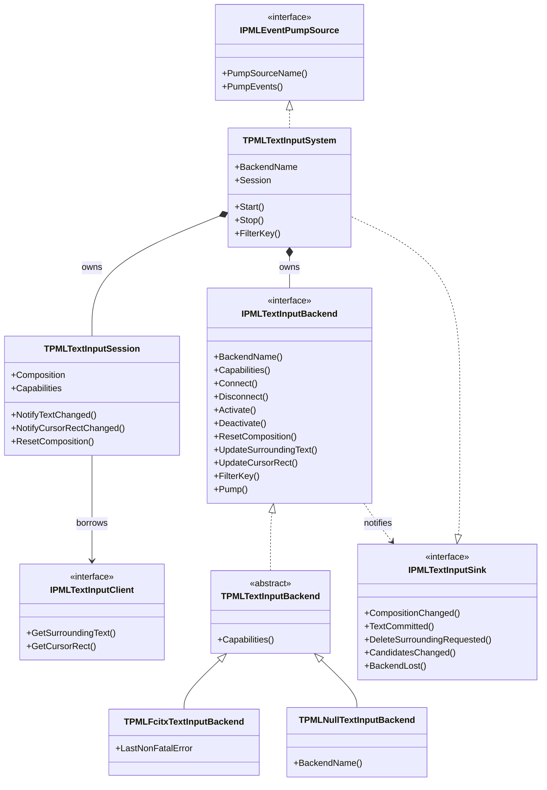

# バックエンド抽象化

Design: `docs/DESIGN.md` §3.2、§3.3 — 正は英語版 [`backend-abstraction.md`](backend-abstraction.md)

**実装済みの型だけを描いてある。** 設計書が予定していて未実装のものは文章で触れるに留め、
図には入れない。図が実装から乖離するのを防ぐため。

生成プロトコルの 125 型（リスナー抽象クラス 45、不透明プロキシ型 80）は**除外**している。
機械的なバインディングなので、構造を覆い隠すだけになる。唯一の例外は
`Twl_registry_listener` で、Wayland バックエンドが生成リスナーを継承している事実を示すために残した。

図は構造だけを載せ、理由は図の外の文章に置く。

---

## 1. なぜこの形なのか

SDL は `SDL_VideoDevice` という**単一の構造体に 98 個の関数ポインタ**を持つ。初期化、
ディスプレイ列挙、ウィンドウ操作 44 個、OpenGL 11 個、Vulkan 6 個、Metal 3 個、イベントポンプ、
クリップボード 10 個、IME 4 個、スクリーンキーボード 4 個が同居している。バックエンドが
対応しない操作は「関数ポインタが `nil`」で表され、呼ぶ側が毎回検査することになる。

| | SDL | papimela |
|---|---|---|
| 構造 | `SDL_VideoDevice` 1 個に 98 関数ポインタ | デバイス / ディスプレイ / ウィンドウの 3 抽象クラス＋任意搭載の部品 |
| 未対応の表現 | 関数ポインタが `nil`。呼び出し側が毎回検査 | 能力集合。公開層が 1 箇所で判定 |
| IME | video device の一部（`StartTextInput` ほか 3 個） | **独立した軸**（図 2） |
| 逆方向の通知 | グローバル関数を直接呼ぶ | `Sink` インターフェース。バックエンドは公開層の型を見ない |

---

## 2. ビデオ軸



**要点。**

- `IPMLVideoSink` の引数はすべてウィンドウを **ID** で指す。オブジェクトでは渡さない。
  バックエンドは `TPMLWindow` を知らない。この一方向の依存（公開層 → 抽象 → 実装）が、
  god object を分解できた要因である。
- §3.2 は `TPMLVideoBackend` に任意搭載の部品 8 種（GL、Vulkan、Clipboard、Cursors、
  ScreenSaver、MessageBox、SystemMenu、ScreenKeyboard）も持たせる予定だが、
  どれも未実装なので描いていない。
- `TPMLWindowBackend` の 22 メソッドが、SDL のウィンドウ操作 44 個のうち実装済みの部分に当たる。
  残り 22 個（フルスクリーン、不透明度、形状、アイコン、キーボードグラブ、ヒットテスト）は未実装。
  ポインタ拘束の 3 メソッドは要求を記録するだけである。拘束オブジェクトは `wl_pointer` に
  紐づくので、`TPMLWaylandConnection.NotifyGrabsChanged` が変化をシートへ渡し、
  `TPMLWaylandPointerGrab` がどの拘束を持つかを決める（`event-model_jp.md` を参照）。
- `TPMLWaylandConnection` が生成リスナー `Twl_registry_listener` を継承しているのは、
  レジストリの `global` イベントでグローバルを束縛するため。

---

## 3. IME 軸（ビデオ軸から独立）



**要点。**

- 形はビデオ軸とまったく同じである。公開層 → 抽象バックエンド → 具体実装、そして逆方向の
  `Sink`。構造上の違いは `IPMLTextInputClient` だけで、これは**アプリ自身が実装する契約**である。
  周辺テキストはアプリのバッファから引き出すしかないため。
- IME 軸はビデオの型を一切知らない。「Wayland ビデオ + fcitx5 IME」という組み合わせが成立するのは
  この独立性による（§3.6）。SDL は IME を video device の一部にしており、それが変換中テキストから
  文節情報を落とす構造的な原因になっている。
- `TPMLTextInputSystem` はバックエンドを**インターフェースと実体の両方で保持している**。
  CORBA インターフェースが参照カウントしないため（不具合 D-08）。図ではコンポジションの
  1 本で表している。

---

## 4. 両軸が共有している形

```
公開層（能力判定・イベント発行）
   |  所有
   v
抽象バックエンド ------+
   |  継承             | Sink インターフェース経由で逆方向へ通知
   v                   | 公開層の型を知らない
具体実装 --------------+
```

どちらの公開層も `IPMLEventPumpSource` としてイベントキューに登録され、`Poll` / `Wait` が
登録順に全ソースを Pump する。ビデオも IME もこの点で対等である。

---

## 5. この図に無いもの

| 対象 | 理由 |
|---|---|
| 生成プロトコルの 125 型 | 機械的なバインディング。`Twl_registry_listener` が代表している |
| 任意搭載の部品 8 種 | 未実装（第 11 章 #33、#38、#39、#40、#67） |
| シート（キーボード / ポインタ / タッチ） | 未実装（#37） |
| IBus / WaylandTI バックエンド | 未実装（#48、#49） |
| 所有グラフ、イベントモデル、基底クラス、IME の値型 | それぞれ別の図。ここに詰め込むと読めなくなる |
