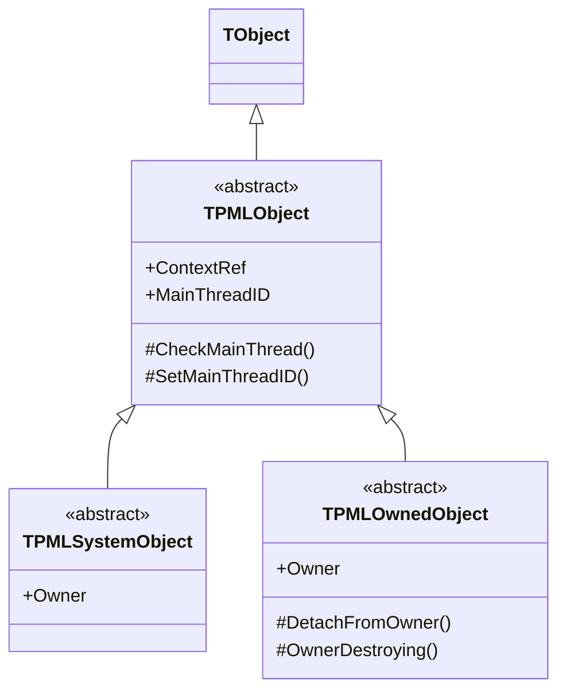
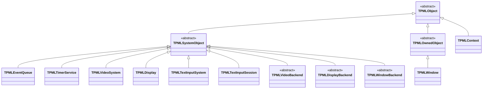

# Base Classes and Ownership Kinds

Design: `docs/DESIGN.md` §4.1, §2.4 — Japanese version: [`base-classes_jp.md`](base-classes_jp.md)

**Only implemented types are drawn.**

---

## 1. What the base classes are for

v1 of the design (written when papimela was still meant to be a binding) had
`TSDLHandleObject<T>`, `OwnsHandle`, `CreateFromHandle` and a handle-to-wrapper reverse lookup.
All of it is gone. In a reimplementation there are no opaque handles — the object *is* the
implementation.

What remains is the minimum needed to express one rule in the type system:

> **Who is allowed to call `Free` on this object?**

Getting that wrong is how reimplementations leak or double-free, so it is worth a type distinction
rather than a comment.

| Base | Who creates it | Who frees it | Examples today |
|---|---|---|---|
| `TPMLSystemObject` | the owning subsystem | **only the owner**; the application must not | `TPMLEventQueue`, `TPMLTimerService`, `TPMLVideoSystem`, `TPMLDisplay`, `TPMLTextInputSystem`, `TPMLTextInputSession`, and every `*Backend` |
| `TPMLOwnedObject` | the application | the application **or** the owner, whichever comes first | `TPMLWindow` |
| `TPMLObject` directly | the application | the application | `TPMLContext` (the root) |

---

## 2. Current descendants

---

## 3. Two details worth knowing

**`ContextRef` is typed `TObject`, not `TPMLContext`.** Pascal cannot forward-declare a class
across unit boundaries, and `TPMLObject` → `TPMLContext` → `TPMLEventQueue` → `TPMLSystemObject`
is a cycle. Splitting the bases into `PaPiMeLa.Core.Base` and typing the back-reference as `TObject`
breaks it; `PaPiMeLa.Core` casts where needed.

**`OwnerDestroying` is what makes `TPMLOwnedObject` safe.** When the owner dies first it calls
`OwnerDestroying` on each child, which clears the back-reference *before* freeing, so the child's
destructor does not try to detach from an owner that is already being torn down. `TPMLWindow`
overrides it to clear `FSystem` for exactly that reason.

`TPMLTextInputBackend` is **not** in this hierarchy — it descends from `TObject` and implements
`IPMLTextInputBackend`. Its lifetime is managed by `TPMLTextInputSystem` holding the object
separately from the interface, because CORBA interfaces are not reference-counted (defect D-08).
`TPMLVideoBackend` does descend from `TPMLSystemObject`, so the two axes are inconsistent here;
that inconsistency is real and worth resolving when the IME axis gains a second backend.
