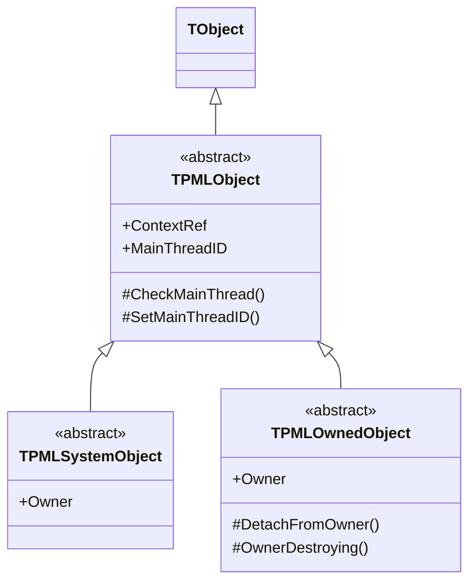
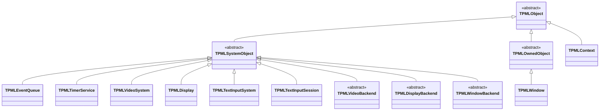

# 基底クラスと所有の種別

Design: `docs/DESIGN.md` §4.1、§2.4 — 正は英語版 [`base-classes.md`](base-classes.md)

**実装済みの型だけを描いてある。**

---

## 1. 基底クラスは何のためにあるか

設計 v1（papimela がまだバインディングのつもりだった頃）には `TSDLHandleObject<T>`、
`OwnsHandle`、`CreateFromHandle`、ハンドル→ラッパーの逆引きがあった。すべて廃止した。
再実装では不透明ハンドルが存在せず、オブジェクトそれ自体が実装本体だからである。

残したのは、次の 1 つの規約を型で表すための最小限だけである。

> **このオブジェクトの `Free` を呼んでよいのは誰か。**

ここを間違えるとリークか二重解放になる。コメントではなく型の区別に値する。

| 基底 | 誰が生成するか | 誰が解放するか | 現在の例 |
|---|---|---|---|
| `TPMLSystemObject` | 所有するサブシステム | **所有者だけ**。アプリは解放してはならない | `TPMLEventQueue`、`TPMLTimerService`、`TPMLVideoSystem`、`TPMLDisplay`、`TPMLTextInputSystem`、`TPMLTextInputSession`、各 `*Backend` |
| `TPMLOwnedObject` | アプリ | アプリまたは所有者の**どちらが先でもよい** | `TPMLWindow` |
| `TPMLObject` を直接 | アプリ | アプリ | `TPMLContext`（ルート） |

---

## 2. 現在の派生

---

## 3. 知っておくべき 2 点

**`ContextRef` の型は `TPMLContext` ではなく `TObject` である。** Pascal はユニットをまたいだ
クラスの前方宣言を許さず、`TPMLObject` → `TPMLContext` → `TPMLEventQueue` →
`TPMLSystemObject` が循環する。基底を `PaPiMeLa.Core.Base` に分け、親への参照を `TObject` 型に
することで断ち切った。必要な箇所で `PaPiMeLa.Core` がキャストする。

**`TPMLOwnedObject` を安全にしているのは `OwnerDestroying` である。** 所有者が先に死ぬとき、
所有者は各子の `OwnerDestroying` を呼ぶ。これが解放**前**に親への参照を切るので、子のデストラクタが
「既に壊れかけている所有者」から自分を外そうとする事態を避けられる。`TPMLWindow` が
これを override して `FSystem` を nil にしているのは、まさにこの理由による。

`TPMLTextInputBackend` は**この階層に属していない**。`TObject` を継承して
`IPMLTextInputBackend` を実装しており、寿命は `TPMLTextInputSystem` がインターフェースとは
別に実体を保持することで管理している（CORBA インターフェースが参照カウントしないため。不具合 D-08）。
一方 `TPMLVideoBackend` は `TPMLSystemObject` を継承しているので、**2 つの軸で不統一がある**。
この不統一は実在するもので、IME 軸に 2 つ目のバックエンドが入る時点で解消すべきである。
