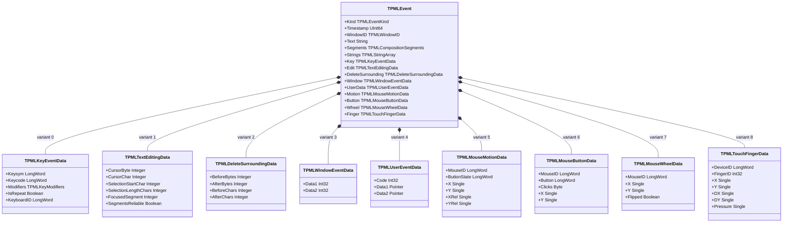
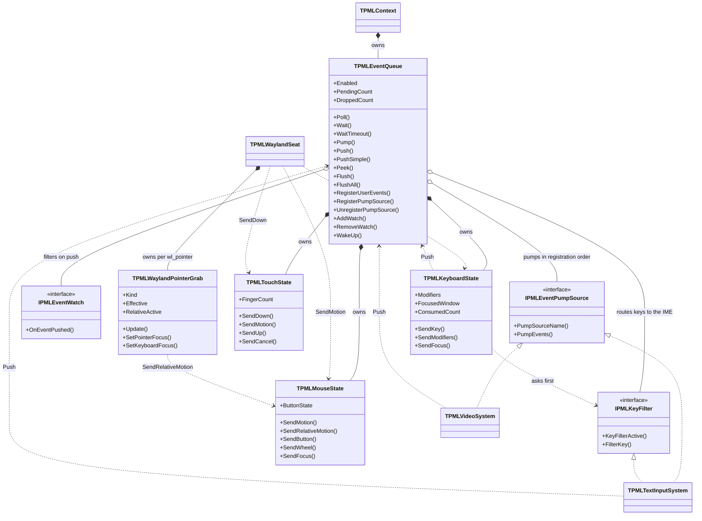

# Event Model

Design: `docs/DESIGN.md` §6 — Japanese version: [`event-model_jp.md`](event-model_jp.md)

**Only implemented types are drawn.**

---

## 1. The problem this solves

SDL stores a `const char *text` inside the event struct and frees it later from inside
`SDL_PollEvent` (`SDL_CleanupEvent`). That works, but the lifetime rule lives in the polling
function rather than in the type.

Since papimela needs no C union compatibility, `TPMLEvent` is a plain record with **managed
fields in front of the variant part**. FPC cannot place managed types inside a `case`, but it can
place them before it. Ref-counting then handles text, clause arrays and candidate lists; ring
buffer overwrite releases them automatically.

`SizeOf(TPMLEvent)` is **80 bytes** on x86_64 (measured; `test/test_fcitx_textinput` reports it on
every run). It was 72 until touch landed: `TPMLTouchFingerData` is the widest variant at 28 bytes.
Key, mouse, touch and window events allocate nothing.

---

## 2. Structure

The first six fields are common to every event; the last nine are alternatives sharing storage.
`TPMLEventKind` currently has 85 members, but only the nine payload shapes above exist — the rest
of the subsystems will add variants as they land, and adding a variant does not disturb existing
code. Adding `TPMLTouchFingerData` is what took the record from 72 to 80 bytes.

---

## 3. Queue and its collaborators

**The key path (§7.5).** A backend never calls `Push` for keys. `TPMLWaylandSeat` hands every key —
press *and* release, modifiers included — to `TPMLKeyboardState.SendKey`, which asks the IME first.
If the IME answers `Consumed`, no `KeyDown` and no `TextInput` is emitted at all; the text will
arrive later as `TextEditing` / `TextInput` from the IME's own path. If it answers `PassThrough`,
the key becomes a normal `KeyDown`, plus a `TextInput` when xkb produced printable text.
`Deferred` (awaiting an async IME reply) is defined but no backend returns it yet.

**The pointer-constraint path.** `TPMLWaylandPointerGrab` holds at most one of
`zwp_locked_pointer_v1` / `zwp_confined_pointer_v1` — they are mutually exclusive on one seat and
surface, and creating both is a protocol error that kills the connection. The window backend only
records what the application asked for; the grab decides, from that request plus pointer and
keyboard focus, which constraint to hold. While locked, the compositor stops sending
`wl_pointer.motion`, so `SendRelativeMotion` is the only source of movement: it emits `MouseMotion`
with `XRel` / `YRel` set and `X` / `Y` frozen.

**Rules.**

- `Push` is callable from any thread. When the ring is full the oldest event is dropped and
  `DroppedCount` increments — tests assert it stays at zero.
- `Poll` and `Wait` are main-thread only (`CheckMainThread`).
- `Pump` walks every registered source in registration order, and only the **first** source is
  allowed to block for the timeout. That is why the video backend must be registered before the
  IME backend once both exist: the one that can wait on a file descriptor should go first.
- `IPMLEventWatch.OnEventPushed` runs on the pushing thread and can drop the event by returning
  `False`.

---

## 4. Known gaps

| Item | State |
|---|---|
| unified `poll(2)` over several file descriptors | not built. Only D-Bus and Wayland contribute descriptors today and each waits on its own; §6.3 wants one `poll` set once that stops being enough |
| `WakeUp` via `eventfd` | currently a flag checked by the wait loop |
| mutex | `SyncObjs.TCriticalSection`; will move to `TPMLMutex` when `PaPiMeLa.Threading` (#8) exists |
| touch hardware verification | `TPMLTouchState` is implemented and covered by `test/test_touch_cursor` with synthetic input, but no touch panel was available: the `wl_touch` path itself is unverified. `shape` and `orientation` (contact size and angle) are not read |
| `Finalize` cost measurement for nil managed fields | size measured, benchmark not run (§10 item 9) |
