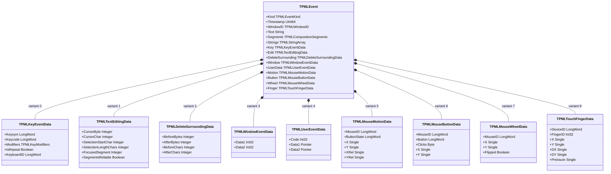
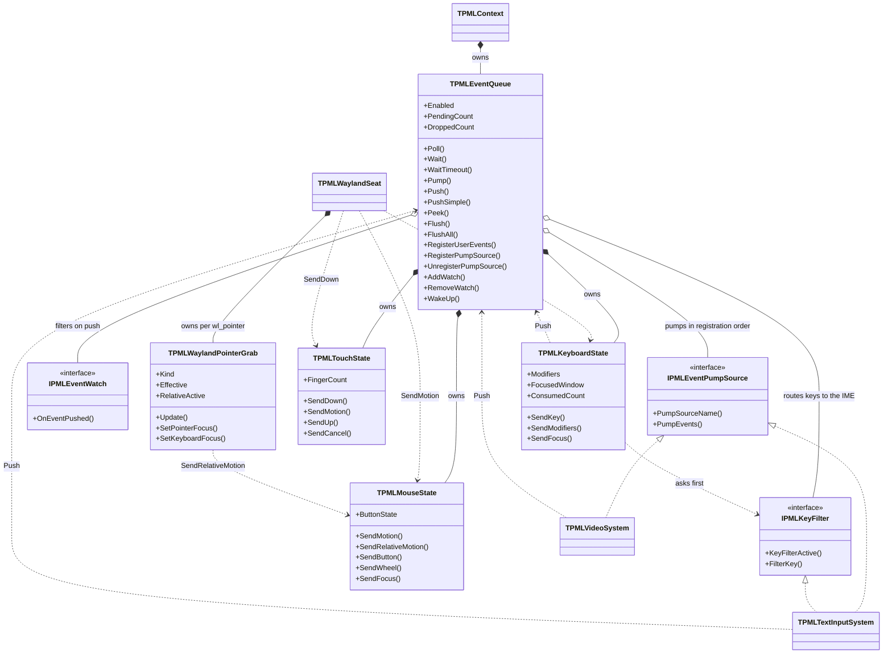

# イベントモデル

Design: `docs/DESIGN.md` §6 — 正は英語版 [`event-model.md`](event-model.md)

**実装済みの型だけを描いてある。**

---

## 1. 何を解決しているか

SDL はイベント構造体の中に `const char *text` を持ち、後から `SDL_PollEvent` の内部
（`SDL_CleanupEvent`）で解放している。動くには動くが、寿命の規約が型ではなく
ポーリング関数の側にある。

papimela は C との共用体互換が不要なので、`TPMLEvent` は**管理型フィールドを可変部の前に
置いた**素のレコードにした。FPC は可変部（`case`）の中に管理型を置けないが、その前になら置ける。
これで参照カウントがテキスト・文節配列・候補一覧の寿命を引き受け、リングバッファの上書きで
自動的に解放される。

`SizeOf(TPMLEvent)` は x86_64 で**80 バイト**（実測。`test/test_fcitx_textinput` が毎回報告する）。
タッチが入るまでは 72 バイトだった。`TPMLTouchFingerData` が 28 バイトで最も幅のある可変部になる。
キー・マウス・タッチ・ウィンドウのイベントはヒープ確保が発生しない。

---

## 2. 構造

先頭 6 フィールドは全イベント共通、残り 9 つは記憶域を共有する選択肢である。
`TPMLEventKind` は現在 85 個あるが、ペイロードの形は上の 9 種類しかない。
各サブシステムが実装されるにつれて可変部が増えるが、**可変部への追加は既存コードに影響しない**。
`TPMLTouchFingerData` を足したことでレコードが 72 バイトから 80 バイトになった。

---

## 3. キューと協調相手

**キーの経路（§7.5）。** バックエンドはキーについて Push を呼ばない。`TPMLWaylandSeat` は
押下も解放も、修飾キーも含めてすべて `TPMLKeyboardState.SendKey` に渡し、そこでまず IME に尋ねる。
IME が `Consumed` と答えたら `KeyDown` も `TextInput` も一切出さない（文字は後から IME 自身の
経路で `TextEditing` / `TextInput` として届く）。`PassThrough` なら通常の `KeyDown` になり、
xkb が印字可能な文字を求めていれば `TextInput` も出す。`Deferred`（IME の非同期返信待ち）は
定義してあるが、返すバックエンドはまだ無い。

**ポインタ拘束の経路。** `TPMLWaylandPointerGrab` は `zwp_locked_pointer_v1` と
`zwp_confined_pointer_v1` のどちらか一方しか持たない。同じシート・同じサーフェスに両方を作ると
プロトコルエラーになり、接続が切られるためである。ウィンドウバックエンドはアプリの要求を
記録するだけで、どの拘束を張るかは、その要求とポインタ・キーボードのフォーカスから拘束側が
決める。ロック中はコンポジタが `wl_pointer.motion` を送らなくなるので、`SendRelativeMotion` が
唯一の移動情報になる。`XRel` / `YRel` だけが動き、`X` / `Y` は止まったままの `MouseMotion` を出す。

**規約。**

- `Push` は任意のスレッドから呼べる。リングが満杯なら最古のイベントを捨て、`DroppedCount` が
  増える。テストはこれが 0 のままであることを検査している。
- `Poll` と `Wait` はメインスレッド専用（`CheckMainThread`）。
- `Pump` は登録されたソースを登録順にたどるが、タイムアウト分ブロックしてよいのは
  **最初のソースだけ**である。両方が揃った時点でビデオバックエンドを IME より先に
  登録すべきなのはこのため。ファイルディスクリプタで待てる側を先頭に置く。
- `IPMLEventWatch.OnEventPushed` は Push したスレッドで実行され、`False` を返すとイベントを落とす。

---

## 4. 既知の未整備

| 項目 | 状態 |
|---|---|
| 複数 fd をまとめた `poll(2)` | 未実装。現状 fd を出すのは D-Bus と Wayland だけで各自が待っている。§6.3 はこれで足りなくなった時点で 1 つの poll セットに統合することを求めている |
| `eventfd` による `WakeUp` | 現在は待ちループが見るフラグ |
| 排他 | `SyncObjs.TCriticalSection`。`PaPiMeLa.Threading`（#8）ができたら `TPMLMutex` へ移す |
| タッチの実機確認 | `TPMLTouchState` は実装済みで、`test/test_touch_cursor` が合成入力で検査している。ただしタッチパネルが手元に無いため `wl_touch` 経路そのものは未検証。`shape` / `orientation`（接触面の大きさと向き）は読んでいない |
| nil の管理型に対する `Finalize` コスト測定 | サイズは実測済み。ベンチマークは未実施（§10 項目 9） |
