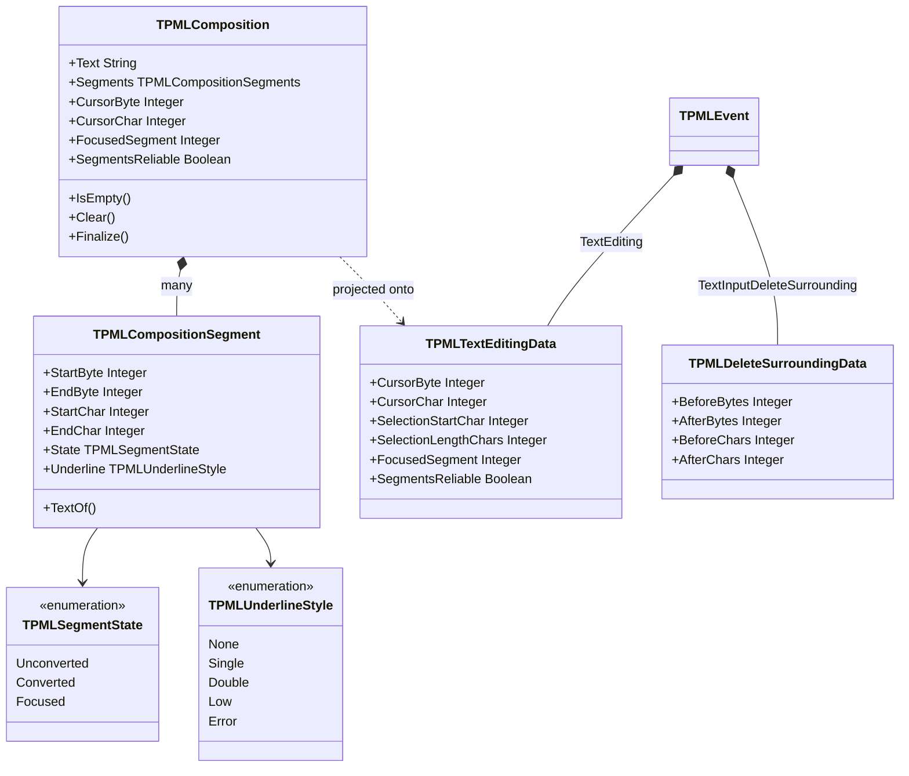

# IME Value Types

Design: `docs/DESIGN.md` §7.3 — Japanese version: [`ime-model_jp.md`](ime-model_jp.md)

**Only implemented types are drawn.** For the classes around these values see
[`backend-abstraction.md`](backend-abstraction.md) §3.

---

## 1. What SDL cannot express

`SDL_TextEditingEvent` carries three fields: `text`, `start`, `length`. That is one range, so it
can describe **the clause currently being converted** and nothing else.

Japanese conversion needs more. While converting 「わたしのなまえ」 the IME produces 私の / 名前 —
two clauses, one of which has focus. An editor has to underline them differently. A single
`start`/`length` pair cannot say where the other clause ends.

Every platform IME has this information. papimela's whole reason for existing is to not throw it
away, so the composition is modelled as **an array of clauses**.

---

## 2. Structure

---

## 3. Three decisions encoded here

**Byte and character positions are both always filled.** Pascal's `String` is a UTF-8 byte
sequence, so an application slices by byte offset; IMEs speak in code points. Rather than making
every application convert, `TPMLComposition.Finalize` fills both and the event carries both.
This is not theoretical tidiness: fcitx5 is itself inconsistent — `UpdateFormattedPreedit` reports
its cursor as a **byte** offset while `SetSurroundingText` takes **character** positions
(defect D-16). `PaPiMeLa.Unicode` absorbs the asymmetry in one place.

**`State` is separate from `Underline`.** `Underline` is the raw style the backend reported;
`State` is papimela's interpretation. Keeping the raw value means a wrong interpretation can be
diagnosed rather than guessed at. It was needed almost immediately: the first mapping rule
("underline only means converted") misclassified pre-conversion kana, because fcitx5-mozc sends
plain `Underline` during romaji entry too. The corrected rule reads "if no clause carries
`HighLight`, the composition has not entered conversion, so every clause is `Unconverted`"
(defect D-15).

**`SegmentsReliable` is explicit.** A backend that cannot supply clause boundaries — Wayland
`text-input-v3`, whose `preedit_string` event has no styling at all — sets it to `False` and
reports the whole string as one segment. The application can then fall back to a single-range
display without guessing whether the absence of clauses is real.

`TPMLTextEditingData` is the flattened projection that rides in the fixed part of `TPMLEvent`;
`SelectionStartChar` / `SelectionLengthChars` reproduce SDL's single range, derived from the
focused clause, so a port from SDL has something familiar to read.

---

## 4. Current state

| Item | State |
|---|---|
| clause boundaries, focused clause | working against fcitx5-mozc (`test/test_fcitx_textinput`) |
| surrounding text supplied to the IME | working |
| delete-surrounding request | path implemented, **never observed** — mozc does not trigger it in ordinary input |
| foreground / background colours per clause | not modelled; IBus reports them, fcitx5 does not. Will be added with the IBus backend (#48) |
| candidate lists | `TPMLEventKind.TextEditingCandidates` exists; no backend fills it yet |
