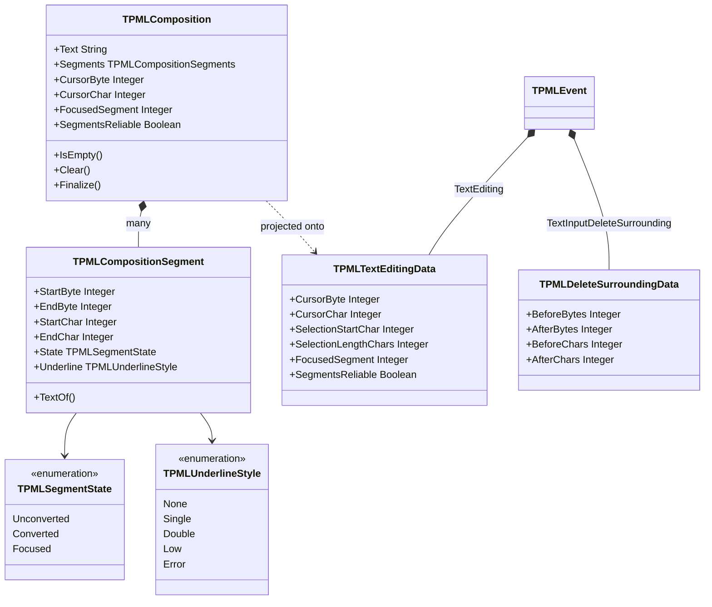

# IME の値型

Design: `docs/DESIGN.md` §7.3 — 正は英語版 [`ime-model.md`](ime-model.md)

**実装済みの型だけを描いてある。** これらの値を扱うクラス群は
[`backend-abstraction_jp.md`](backend-abstraction_jp.md) §3 を参照。

---

## 1. SDL では表現できないもの

`SDL_TextEditingEvent` が持つのは `text` / `start` / `length` の 3 つだけである。範囲が 1 組しか
無いので、**いま変換対象になっている文節**しか表せない。

日本語変換にはそれでは足りない。「わたしのなまえ」を変換すると IME は 私の / 名前 の
2 文節を返し、そのうち 1 つに注目がある。エディタは両者を違う下線で描き分ける必要がある。
`start` / `length` の 1 組では、もう一方の文節がどこで終わるかを言えない。

この情報はどのプラットフォームの IME も持っている。それを捨てないことが papimela の
存在理由そのものなので、変換中テキストは**文節の配列**としてモデル化してある。

---

## 2. 構造

---

## 3. ここに込めた 3 つの判断

**バイト位置と文字位置を常に両方埋める。** Pascal の `String` は UTF-8 のバイト列なので、
アプリはバイトオフセットで切り出す。一方 IME はコードポイントで話す。毎回アプリに変換させる
代わりに、`TPMLComposition.Finalize` が両方を埋め、イベントも両方を載せる。
これは理屈の上での整頓ではない。fcitx5 自身が不統一で、`UpdateFormattedPreedit` の cursor は
**バイト**オフセットなのに `SetSurroundingText` は**文字**位置を取る（不具合 D-16）。
`PaPiMeLa.Unicode` がこの非対称を 1 箇所で吸収している。

**`State` と `Underline` を分けてある。** `Underline` はバックエンドが報告した生のスタイル、
`State` は papimela による解釈である。生の値を残しておけば、解釈を間違えたときに推測ではなく
診断ができる。実際すぐ必要になった。最初のマッピング規則（「下線のみ＝変換済み」）は
変換前のかなを誤分類した。fcitx5-mozc はローマ字入力中にも素の `Underline` を送ってくるからである。
訂正後の規則は「どの文節にも `HighLight` が無ければ変換段階に入っていないので、
全文節を `Unconverted` とする」（不具合 D-15）。

**`SegmentsReliable` を明示的に持つ。** 文節境界を提供できないバックエンド
（`preedit_string` にスタイル情報が一切無い Wayland `text-input-v3` など）はこれを `False` にし、
文字列全体を 1 文節として報告する。アプリは「文節が無いのが実態なのか、取れなかっただけなのか」を
推測せずに単一範囲表示へフォールバックできる。

`TPMLTextEditingData` は `TPMLEvent` の固定部に載せるための平坦化した射影である。
`SelectionStartChar` / `SelectionLengthChars` は注目文節から導出した SDL 互換の単一範囲で、
SDL からの移植者が読める形を残してある。

---

## 4. 現状

| 項目 | 状態 |
|---|---|
| 文節境界・注目文節 | fcitx5-mozc に対して動作（`test/test_fcitx_textinput`） |
| IME への周辺テキスト供給 | 動作 |
| 周辺削除の要求 | 経路は実装済みだが**未観測**。mozc は通常の入力では発火させない |
| 文節ごとの前景色 / 背景色 | 未モデル化。IBus は報告するが fcitx5 は報告しない。IBus バックエンド（#48）と同時に追加する |
| 候補一覧 | `TPMLEventKind.TextEditingCandidates` は存在するが、埋めるバックエンドがまだ無い |
