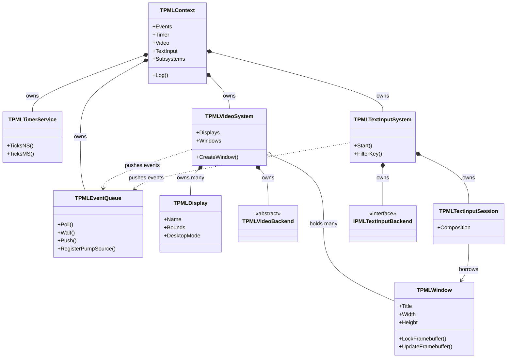

# Ownership Graph

Design: `docs/DESIGN.md` §2.4 — Japanese version: [`ownership-graph_jp.md`](ownership-graph_jp.md)

**Only implemented types are drawn.** See [`backend-abstraction.md`](backend-abstraction.md) for the
policy behind that.

---

## 1. Why this matters

`SDL_video.c` holds a file-scope variable `static SDL_VideoDevice *_this`, dereferenced in
456 places. Everything reachable from the video subsystem is reachable through that global, which
is why SDL cannot hold two video devices in one process.

papimela has no such global. `TPMLContext` is the only object the application creates, and every
other object is reachable from it by an explicit edge. Creating two contexts in one process is not
forbidden — opening two Wayland connections is legal.

---

## 2. What exists today

---

## 3. Rules the graph encodes

1. **The parent holds the child; the child holds a borrowed reference back.** Destruction always
   starts at the parent.
2. **Destruction order is the reverse of construction**: TextInput → Video → Timer → Events.
   `TPMLContext.Destroy` does exactly this. The IME backend has to go first because it may still
   call into a session that references a window.
3. **Composition (`*--`) versus aggregation (`o--`)** is not decoration here, it is the
   `TPMLSystemObject` / `TPMLOwnedObject` distinction described in
   [`base-classes.md`](base-classes.md). `TPMLWindow` is the one aggregated child: the application
   creates it and may free it, or may leave it to the system.
4. **No `finalization` sections.** Teardown is driven entirely by `Context.Free`.
5. The thread that constructs the context is the main thread; children inherit that ID and
   `CheckMainThread` enforces it in debug builds.

---

## 4. Not in the graph yet

| Subsystem | State |
|---|---|
| Audio (`TPMLAudioSystem`) | not implemented; `TPMLContext.Create` raises `EPMLUnsupported` if requested |
| Joystick / Gamepad / Haptic | same |
| `TPMLRenderer`, `TPMLGLContext`, `TPMLTexture`, `TPMLSurface` | not implemented (chapter 11: #41, #33) |
| `TPMLClipboard`, `TPMLCursor` | not implemented (#38, #39) |
| `TPMLHints`, `TPMLLog` | not implemented; logging currently goes straight to stderr from `TPMLContext.Log` |

The planned full graph is in `docs/DESIGN.md` §2.4. It is deliberately **not** mirrored here: this
file documents what the code does today.
