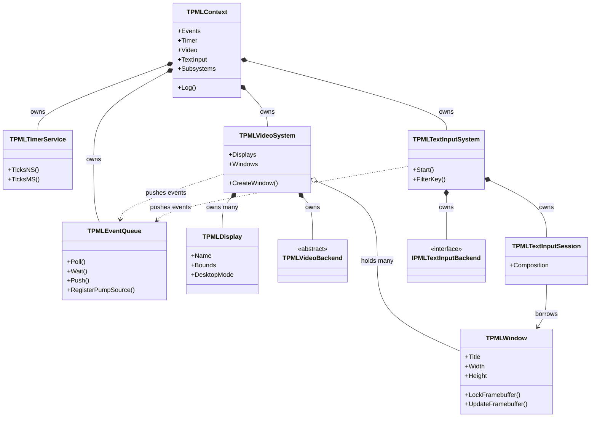

# 所有グラフ

Design: `docs/DESIGN.md` §2.4 — 正は英語版 [`ownership-graph.md`](ownership-graph.md)

**実装済みの型だけを描いてある。** 方針は [`backend-abstraction_jp.md`](backend-abstraction_jp.md) を参照。

---

## 1. なぜこれが重要か

`SDL_video.c` にはファイルスコープの `static SDL_VideoDevice *_this` があり、**456 箇所**から
参照されている。ビデオサブシステムから到達できるものはすべてこのグローバル経由であり、
SDL が 1 プロセスに 2 つのビデオデバイスを持てないのはこの構造のためである。

papimela にはこの種のグローバルが無い。アプリが生成するのは `TPMLContext` だけで、
他のオブジェクトはすべて明示的な辺をたどって到達する。1 プロセスに 2 つの Context を
作ることも禁じていない（Wayland 接続を 2 本張るのは合法である）。

---

## 2. 現在あるもの

---

## 3. このグラフが表している規約

1. **親が子を保持し、子は親への借用参照を持つ。** 破棄は必ず親から始まる。
2. **破棄順序は生成の逆順**、すなわち TextInput → Video → Timer → Events。
   `TPMLContext.Destroy` がそのとおりに実装されている。IME を最初に落とすのは、
   セッションがウィンドウを参照したまま生き残らないようにするため。
3. **コンポジション（`*--`）とアグリゲーション（`o--`）の区別は装飾ではない。**
   [`base-classes_jp.md`](base-classes_jp.md) で説明する `TPMLSystemObject` と
   `TPMLOwnedObject` の違いそのものである。アグリゲーションで繋がる子は `TPMLWindow` だけで、
   アプリが生成し、アプリが解放してもシステムに任せてもよい。
4. **`finalization` 節では何もしない。** 後始末は `Context.Free` が駆動する。
5. Context を生成したスレッドがメインスレッドであり、子はその ID を継承する。
   デバッグビルドでは `CheckMainThread` が違反を検出する。

---

## 4. まだグラフに無いもの

| サブシステム | 状態 |
|---|---|
| Audio（`TPMLAudioSystem`） | 未実装。要求すると `TPMLContext.Create` が `EPMLUnsupported` を投げる |
| Joystick / Gamepad / Haptic | 同上 |
| `TPMLRenderer`、`TPMLTexture`、`TPMLSurface` | 実装済み（#41、#42、#28）だが図にはまだ描いていない。ウィンドウへ描くレンダラの所有者は `TPMLWindow` で、ウィンドウは `IPMLWindowDependent` 経由でレンダラを先に畳む。テクスチャはレンダラと一緒に消える。サーフェスへ描くレンダラと `TPMLSurface` 自体はアプリが所有する |
| `TPMLGLContext` | 実装済み（#33、#39）だが図にはまだ描いていない。ウィンドウへ描くレンダラと同じく所有者は `TPMLWindow`（`IPMLWindowDependent`） |
| `TPMLClipboard`、`TPMLCursor` | 未実装（#38、#39） |
| `TPMLHints`、`TPMLLog` | 未実装。ログは現在 `TPMLContext.Log` から直接 stderr へ出している |

完成時の全体グラフは `docs/DESIGN.md` §2.4 にある。ここには**意図的に写していない**。
この文書は「今のコードがどうなっているか」を記録するためのものである。
